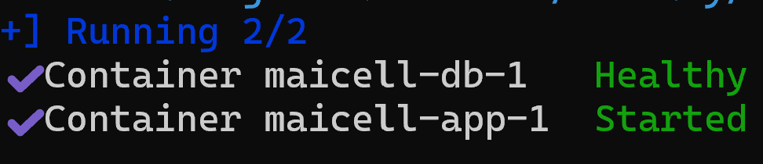

This README goes through all the clarifications of the project in order to understand it and make it easier for any user to deploy and/or change any code to the user's discretion.

You can see a demo of the actual service in: **https://maicell-production.up.railway.app/flows** and the Swagger at **https://maicell-production.up.railway.app/api/docs**

There is the **Postman** collection in the designated folder.

## Set UP

### Requirements
The list of requirements can be seen in the file **requirements.txt** but include:
Node.js=v24.15.0
npm=11.12.1
Git=2.51.0
Docker=28.4.0
Docker_Compose=v2.39.2

# Database (Docker Compose)
PostgreSQL_image=postgres:16-alpine
Host_port=8080
Container_port=5432
Database=MaicellDB

# Backend (NestJS)
@nestjs/common=^11.0.1
@nestjs/config=^4.0.4
@nestjs/core=^11.0.1
@nestjs/typeorm=^11.0.3
typeorm=^0.3.27
pg=^8.22.0
class-validator=^0.15.1
class-transformer=^0.5.1
TypeScript=^5.7.3
Jest=^30.0.0
supertest=^7.0.0

# Frontend (Angular)
@angular/core=^19.2.0
@angular/cli=^19.2.27
primeng=^19.1.4
@primeng/themes=^19.1.4
primeicons=^8.0.0
TypeScript_frontend=~5.7.2

In order to test it locally in your pc there are several steps that need to be followed.
### 1. Clone and configure environment

```
bash
git clone https://github.com/celades5/Maicell.git
cd Maicell
```

Then create a root `.env` for Docker Compose so credentials are not hardcoded or committed. This repo already includes a **`.gitignore`** that ignores `.env` and other files. Use your own values (examples below are placeholders only):

```env
POSTGRES_USER=<your-db-user>
POSTGRES_PASSWORD=<your-db-password>
POSTGRES_DB=MaicellDB
POSTGRES_PORT=8080
APP_PORT=3000
```

If you run Nest with `npm` against Docker Postgres, also create `backend/.env` with matching placeholders:

```env
PORT=3000
DB_HOST=localhost
DB_PORT=8080
DB_USERNAME=<your-db-user>
DB_PASSWORD=<your-db-password>
DB_DATABASE=MaicellDB
NODE_ENV=development
```

### 2. Start Docker (PostgreSQL + Nest + Angular)

Once Step 1 is finished, from the repo root run **`docker compose up -d --build`** to start the Docker container. Wait until the container is healthy, this can be checked by `docker compose ps` or by a message from the used terminal mentioning the container is up and running. Host port **8080** maps to Postgres **5432** inside the container. To avoid clashes with other Projects, port 8080 has been used for this scenario. If you wish to change it, first stop the running container with `docker compose down`, update `root .env` port and then match it at the backend so Nest can connect. After start the container again and check is running in healthy mode. When that happens it will have a healthy postgres service using the image established in the `docker-compose.yml` in this case **postgres:16-alpine** which contains a small Linux environment with PostgreSQL 16 already installed and configured to start when the container boots. 

Wait until both services are up. You should see something like:



You can also check with `docker compose ps` or `docker compose logs app --tail 30`.

With the full Compose stack you do **not** need separate `npm` terminals for Nest or Angular.
Do not bind another process to port 3000 while the Compose `app` container is already using it.

Optional local-dev workflow is below.

### 3. Optional: run the backend with npm

Only if you are **not** using the Compose `app` container (or you stopped it). From the repo root:

```bash
cd backend
npm install
npm run start:dev
```

API listens on [http://localhost:3000](http://localhost:3000) with global prefix `/api` (for example `GET /api/flows`, `GET /api/component-definitions`). Swagger is at [http://localhost:3000/api/docs](http://localhost:3000/api/docs).

On starting, Nest loads components from `definitions/` (for example `challenge-library.json` and the `myesb-*Type.json` schemas). If those schemas live elsewhere, set **DEFINITIONS_DIR** in `backend/.env`.

After executing the command to run the backend, first Nest will begin creating the app and wiring the modules. Will load the component schemas from the designated folder or the specified route as mentioned above and will list the endpoints under the /api prefix. After loading everything a healthy message shoudl be seen `Nest application successfully started +%ms`.

### 4. Optional: run the frontend with npm

Only for Angular development with live reload. Keep Nest on port 3000 (`npm run start:dev`), then in another terminal:

```bash
cd frontend
npm install
npm start
```

This runs `ng serve --proxy-config proxy.conf.json`, which proxies `/api` to `http://localhost:3000`.

UI is at [http://localhost:4200](http://localhost:4200). Dev proxy forwards /api to http://localhost:3000. If port 4200 is already in use, ng serve may offer another port — prefer freeing 4200, because backend CORS is configured for http://localhost:4200. **Full Docker stack (recommended for a quick run):** use only Step 2 and open [http://localhost:3000](http://localhost:3000).

## Database
We use **PostgreSQL** as the database (persistence layer) for this challenge because:

- It is production-like and matches how NestJS + TypeORM are commonly used in real systems.
- Unique flow names can be enforced with a database unique constraint (duplicate creates/updates map cleanly to a **409 Conflict**).
- Component configuration is stored as JSON; PostgreSQL supports this well (JSON/JSONB).
- TypeORM has solid first-class support for PostgreSQL.
- PostgreSQL is compatible with **TimescaleDB**, so the same stack can later support time-series workloads (e.g. flow run metrics, polling history) without changing the core database choice.

## Docker

We run the stack with **Docker Compose** so that:

- Anyone can start the database with one command (`docker compose up -d --build`) without a local Postgres install.
- Credentials and ports stay consistent across machines via `docker-compose.yml`.
- The app stays portable: same DB version and config for development and review.
- The same Docker setup can be deployed with **Railway**, using compose files such as `docker-compose.yml` / `Dockerfile` for hosting beyond local development.
## Tests
There are three groups of tests. Backend/frontend **unit** tests do not require `npm run start:dev` / `npm start`. Backend *e2e* needs PostgreSQL running (`docker compose up -d --build`).

### 1. Backend unit — `cd backend && npm test`

Does **not** need the API server or the UI.

**Component definitions** (`component-definitions.service.spec.ts`)
- Exactly 4 whitelisted components
- Catalog labels/roles merge correctly
- Required flags, types, defaults, options
- Fields sorted by order
- Nested / advanced / beanreference excluded
- Results cached across getAll()

**Flow validation** (`flow-validation.service.spec.ts`)
- Valid example flow accepted
- Wrong role rejected
- Missing required config rejected
- `file-uri` must start with `file`:
- Unknown component ids rejected
- Zero services allowed

**Flows service** (`flows.service.spec.ts`)
- Missing flow → `NotFoundException`
- Duplicate name DB error → `ConflictException` (409)
- Create succeeds after validation

**App controller** (`app.controller.spec.ts`)
- Root handler returns `"Hello World!"`

Filter examples:

```bash
npm test -- --testPathPatterns=component-definitions
npm test -- --testNamePattern="FlowValidationService"
```

### 2. Backend e2e — `cd backend && npm run test:e2e`

Needs Postgres up.

- `flows.e2e-spec.ts`: Flows CRUD, duplicate endpoint, **409** on duplicate name, delete returns success body
- `app.e2e-spec.ts`: `GET /` returns `Hello World!`

### 3. Frontend — `cd frontend && npx ng test` (or `npm test`)

- App creates
- Sidebar links (“Flows”, “Create New Flow”)
- Definitions service `GET /component-definitions`
- Flows service CRUD HTTP verbs (mocked)
- Renders inputs from `configFields`


## Assumptions
Several assumptions have been made for this challenge. First, **no authorization** is handled, single trusted local/demo user, the API is open. There is also no visual or diagram of a flow editor, a single UI is presented. 

The app lets the use configure flows only, there is no runtime execution of consumers / services / producers. The app is able to let the user choose **names, components, config fields** and save that to the DB chosen. The model lets the user have 1 consumer + 0+ services + 1 producer. The consumer can only be **Scheduler** while the Producer can only be **File Drop**. As mentioned before the services can be 0+ combinations. The app allows the user to have more than one service, which will be stored with an index, the user can at the time of creation or editing to change the order of the services.

A form of catalog is built by merging **two file types:** `challenge-library.json` holds identity for each component (**id**, display **name/label**, **description**, **category**), while each `definitions/myesb-*Type.json` (for example `myesb-cron-consumerType.json`) holds the **form/config schema** (field keys, labels, required/optional, types, defaults, options). At startup, Nest takes the **4 whitelisted** ids, joins each library entry with its matching Type schema into one normalised definition, and keeps the result in memory. Later, `GET /api/component-definitions` reuses that cache. That has been done this way since the catalog doesn’t change while the app runs unless the user decide to modify the JSON files manually. As mentioned above, merging library + Type schemas once at startup is simple and fast.

Host DB port is 8080 to avoid clashing with 5432 port in other projects that may go running at the same time. Only the four components given for the challenge are allowed in the app, the other components in the **challenge-library.json** such as Kafka, OAuth,... are ignored by Nest. Deleting flows as action removes the row from the DB, allowing then to create a new flow with the same name as the one that has been deleted. Since file location is a **URI** OS paths that are not in URI form are not allowed and will return a 400 error. Even though the **File Reader** description allows the URI starting with `classpath`: the challenge only allows for paths starting with `file:` for the pipeline to work for File Reader and File Drop directory.

An MVP approach has been followed in order to complete the challenge. Despite the schemas of the components being very large, to complete the challenge forms and validations are restricted to the necessary criteria. Nested sequence fields, advanced fields and beanreference fields are ignored.

By using Docker Compose, you can start Postgres alone and the full stack (Postgres + Nest + Angular in the `app` service).

**Important:**
- Two flows cannot both be named `<NAME>`. This will trigger an 409 error.
- Two flows can both have the same consumer config id.
- A flow can be named `<NAME>` and also have a component config id with said `<NAME>` if desired since the are different fields, although is not recommended.
- Only the flow name is uniqueness-checked.

The files `.env` contain the users and passwords used for the challenge so Docker Postgres and Nest match. They are not production ready for its simplicity.

Several things have been added in order to simulate a production integration flow like the checked message to `Delete after reading / autostart` since they are a Type.json metadata located in the definitions files, they have no runtime effect.

The UI shows catalog labels (e.g. Scheduler, File Drop); the database and API persist the ids (e.g. myesb-cron-consumer, myesb-file-producer).

TypeORM synchronize is enabled in development so tables follow entity changes automatically; it is disabled when NODE_ENV=production. On each backend start, TypeORM compares the entities to the DB and tries to match them: create missing tables/columns, alter types when it can, drop columns that no longer exist on the entity, etc.


The app **does not:**

- run the cron on a schedule
- read files from disk when the schedule fires
- transform XML → JSON.
- drop files into an output folder
- talk to a live ConnectPlaza/ESB engine
- Have **no** consumer/producer or more than one
- Services without the required consumer/producer pair won't run

 
## Interpretation and use of the component definitions

The files given for the challenge are treated as a static catalog instead of a running ESB. As mentioned in previous **Assumptions** section, two files are combined to get all the information:

- **challenge-library.json:** Identity: id, display name, description, category and which index it belongs to (consumer / service / producer)

- **myesb-*Type.json:** Schema form such as field keys, labels, required/optional (use), types (appinfo.fieldType), defaults, enumerations, display order.

At Nest startup, only the four challenge components are taken from the library (Scheduler, File Reader, XML→JSON, File Drop). Each is joined with its matching *Type.json into one normalised shape: `id, name, description, category, role, configFields[]`. That list is cached in memory and exposed as `GET /api/component-definitions`. Kafka, OAuth, and other library entries are ignored due to limitation of time.

As it has also been mentioned, the schemas are large so several information has been taken aside such as:

- nested sequence blocks
- beanreference fields

In essence, simple fields needed for a valid config pipeline (id, cron / cron-expression, file-uri, return-type, directory, and similar options such as autostart / delete-after-reading). The use can be separated into two sections as the app config files folder do, **backend** and **frontend**: 

**Angular**: loads definitions and builds dynamic config forms from configFields (no hardcoded field lists per component). The UI shows catalog labels (e.g. Scheduler); the API/DB store ids (e.g. myesb-cron-consumer).

**Backend**: validation — on create/update, checks whitelist id, role match (consumer/service/producer), required fields, and basic types against the same definitions. Extra domain rule: file-uri and producer directory must start with file: (even though ConnectPlaza also mentions classpath:).

Saving a flow persists config; it does not schedule cron, read files, or transform XML.
Definitions stay file-backed + in-memory because they are static challenge assets. Flows (user data) live in PostgreSQL. Changing a JSON file requires a Nest restart so the cache reloads. To present a more profesional and production ready flow, some ''add-ons'' have ben taken into account such as autostart at Consumer and delete-after-reading at service if chosen. They are stored from Type.json metadata but have no runtime effect.

Each component id has a fixed role:

`myesb-cron-consumer` → consumer
`myesb-filereader-service` / `myesb-xml2json-transformer` → service
`myesb-file-producer` → producer

When a flow is saved, the backend checks not only “is this id allowed?”, but also “is it in the right slot?”. If you put File Drop in the consumer slot, validation fails with 400 and a message like “myesb-file-producer is a producer, but consumer requires a consumer”. This can be seen if the user tries through Postman / ThunderClient etc..

That prevents invalid pipeline shapes such as “producer as consumer” or “Scheduler as a middle service step”.


## Validation

Validation is handled in three ways when integrating a flow:

1 - **Frontend:** Before calling the API, the form checks required controls. If something’s missing, the user will see a banner + toast and no HTTP request. This stops obvious empty saves.

2 - **Backend:** On every request, Nest checks the DTO (CreateFlowDto / UpdateFlowDto) in order to validate that:

- name is a non-empty string
- consumer / producer / services have the expected structure
- unknown top-level properties are rejected (forbidNonWhitelisted) 


3- **FlowValidationService:** On create/update, before DB save, Nest validates against the cached component definitions:

In the UI, the dropdown only allows to list **Scheduler** but if the user tries to do that in the **Swagger** / **curl** or **Postman/ThunderClient** and tries to change the **componentId**, the backend validation rule will run and return a **400 error**. Similar to it, even though a broker messame like Kafka is not implemented, is present in the JSON and is not an allowed component, therefore it will also return a **400** eror. Schemas say which keys are required, if missing a **400 REQUIRED_CONFIG** will arise. Values must match the field type from `Type.json` as boolean fields need true/false but will not accept ''yes'', enumeration must be one of the allowed options (e.g. return-type: TEXT | XML | BYTES) for the `"return-type":`. Any of this missmatches will trigger an **400 INVALID_ENUM** error. In addition of this schema rules, Nest also checks for the `file-uri` / `directory` as it must start with `file:` as mentioned in previous sections for both File Reader and File Drop, will also trigger an error. 

Separately, Postgres unique constraint on flow name, since as mentioned to work flows cannot have the same name, that will trigger a **409 Conflict** error.

## Trade-offs

Nest loads the component JSON files once at startup into an in-memory cache. That keeps create/update validation fast and simple (no disk I/O on every request) and the catalog stays versioned with the repo. The cost is that if you edit those JSON files by hand, Nest must be restarted (or the app container rebuilt/recreated) before the UI and API see the change. Storing definitions in Postgres (or watching the folder and reloading) would allow live updates, at the cost of more moving parts.

The app is config-only: it does not run an ESB. That matches the assignment and keeps the system safer and simpler, but Scheduler cron does not fire, files are not actually read or written, and XML→JSON is not executed at runtime.

TypeORM `synchronize` (including `DB_SYNCHRONIZE` on Railway/Docker demos) makes schema setup fast for local and demo environments. It is not migration-safe for long-term production; proper migrations would be the next step.

UI and API ship in one Docker image, so one URL on port 3000 is enough to run and deploy. The downside is that a frontend change needs a new image build, and day-to-day Angular hot reload still works better with `ng serve` on port 4200 against Nest on 3000.

Flow list search and sort are client-side on top of `GET /flows`. That keeps the API simple, but it will not scale well if the dataset grows to thousands of flows (server-side filter/sort/pagination would be needed).

The API has no authentication. That makes Postman and Swagger demos easy, but anyone who can reach the URL can create, update, or delete flows.


## Simplified 

There is No runtime execution since cron does not fire, files are not read/written, XML→JSON does not run, and there is no live connection. The app only configures and stores flows. There is no authentication for the API, meaning is open. There is also no visual / diagram of flow editor.

Only the 4 challenge components are allowed; the rest of challenge-library.json (Kafka, OAuth, …) is ignored. As mentioned previously, Nested sequence, advanced, and beanreference fields are excluded from forms and validation. For the challenge the File URIs must start with `file:` for both File Reader file-uri and File Drop directory (not `classpath:`).

Other limits not covered: no soft delete, and no dedicated global exception filter beyond Nest defaults plus the custom 400/404/409 payloads from services.


## Improvements

- **Authorization:** At least basic auth or API keys so the open API is not publicly writable such as API keys or JWT.

- **Security:** The use of encrypting libraries such as **bcrypt** or **hashlib** for secure derivation.

- **Rate limiting:** Since current Railway URL is public, adding a rate limiting to limit the amoutn of `POST /api/flows` an avoid a **429 Too many request**.

- **Migrations:**  turn off synchronize in all non-throwaway envs; version schema changes safely.
Richer catalog usage.

- **Soft-delete/archive:** Keep a history of the deleted flows / archive those instead of hard-deleting them.

- **DB Catalog:** Adding the catalog in Postgres instead of having the definitions load at boot. Watchers, admin roles and cache invalidation would be applied, gaining a more production ready enviroment.

- **More components:** Take more information from the json files since most of them are extensions of the MVP components that were selected and would help cover more real triggers and enable more combinations such as File Pickup for a new Consumer role or FTP pickup for server pipelines.


## AI Tools
AI tools such as Cursor has benn used for the challenge. AI has designed the test based on the clarification that they needed to be focused in based on the criteria of the assigment.

In addition AI handled the CSS and part of the frontend changes design based on a set of instructions after the initial skeleton was implemented.